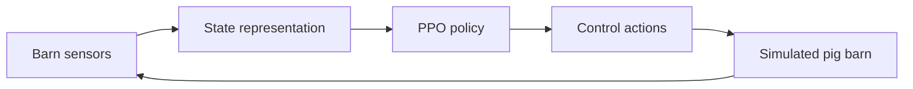

# P3 — Proactive Pig Production

**Animal-centric AI for proactive indoor swine environmental control**

This repository contains research prototypes, notebooks, visualizations, and web pages developed for the **P3 (Proactive Pig Production)** project. The broader goal of P3 is to explore how precision livestock farming, machine learning, and reinforcement learning can support proactive environmental management in pig barns, with the long-term aim of improving animal welfare, productivity, energy efficiency, and sustainability.

> **Important:** The materials in this repository are research and educational prototypes. They are not validated for real-time production barn control and should not be used to operate animal housing equipment without domain-expert review, engineering safeguards, animal welfare oversight, and field validation.

---

## Project Motivation

Commercial pig barns are commonly controlled using environmental measurements such as indoor air temperature. However, pigs of different ages, sizes, health states, and physiological conditions can respond differently to the same barn environment. A temperature-only, reactive control strategy may therefore fail to capture the true animal comfort state.

P3 investigates a more animal-centric approach: using pigs themselves as biological sensors. By combining environmental sensing, visual/thermal behavior analysis, statistical modeling, and reinforcement learning, the project explores how barn control can move from reactive temperature-based control toward proactive animal-based intervention.

---

## Repository Overview

This repository currently includes two major prototype directions:

1. **Swine thermal-control reinforcement learning**  
   A simulated pig-barn environment and PPO-based reinforcement learning controller for learning heater, fan, and sprinkler control policies.

2. **Pig thermal-stress classification**  
   A multimodal RGB + infrared image classification workflow for recognizing cold, neutral, and hot thermal-stress states.

The repository also includes HTML pages that summarize and visualize the current progress of these research components.

---

## Repository Contents

| File | Description | Status |
| --- | --- | --- |
| `pig-rl-model.ipynb` | Notebook for the swine thermal-control reinforcement learning model. It defines the simulated barn environment, reward function, PPO training setup, and evaluation scenarios. | Active prototype |
| `RL_webpage.html` | Webpage summarizing the SwineRL thermal-control model, including architecture, observation/action design, comfort zones, training pipeline, and scenario results. | Active visualization |
| `piglets_cold_spring.png` | Scenario visualization for piglets under a cold spring condition. | Result figure |
| `adults_brutal_summer.png` | Scenario visualization for adult pigs under a summer heat-stress condition. | Result figure |
| `behaviour_classification_farm_data.html` | Webpage summarizing the RGB + IR thermal-stress classification model trained/evaluated on farm data. | Active visualization |
| `behaviour_classification_old_data.html` | Earlier webpage for behavior/thermal-stress classification using an older dataset. | Archived visualization |
| `pig_behaviour_classification_old.ipynb` | Legacy classification notebook for the older dataset. | Archived prototype |
| `readme.md` | Repository README file. | To be replaced by this document |

---

## Component 1: Swine Thermal-Control Reinforcement Learning

The RL component studies whether an agent can learn a useful thermal-control policy for a simulated pig barn. The agent observes barn and herd state information and chooses equipment-control actions.

### Main idea

The simulator models a closed-loop control process:



### Observation space

The current SwineRL prototype uses an 18-dimensional observation vector. The observation includes information such as:

- Air temperature
- Perceived pig temperature
- Difference between air and perceived temperature
- Heater, fan, and sprinkler states
- Piglet, young-pig, and adult-pig counts
- Humidity and humidity-availability flag
- CO2 and CO2-availability flag
- Clock encoding and clock-availability flag

### Action space

The agent outputs five binary control decisions:

- Heater 1 on/off
- Heater 2 on/off
- Fan 1 on/off
- Fan 2 on/off
- Sprinkler on/off

### Comfort zones

The default comfort ranges used in the current prototype are:

| Group | Comfort range |
| --- | --- |
| Piglets | 28–34°C |
| Young pigs | 18–26°C |
| Adults | 15–22°C |

### Training setup

The current prototype uses PPO training with curriculum-style variation across herd composition and environmental conditions. The training process includes:

1. Environment and reward design
2. Base PPO training
3. Policy fine-tuning
4. Scenario-based evaluation
5. Diagnostic visualization

The reward function is designed to balance several objectives:

- Keep pigs within their thermal comfort zone
- Reduce hot/cold stress
- Avoid unnecessary energy use
- Avoid conflicting equipment actions, such as heating and cooling simultaneously
- Reduce excessive equipment switching
- Maintain robustness under missing sensor signals and varied scenarios

### Example evaluation scenarios

The visualization page currently highlights scenarios such as:

- Piglets on a cold spring day
- Adults under summer heat stress

Additional scenarios can be added to test robustness under different herd compositions, weather patterns, sensor availability, and disturbance events.

---

## Component 2: Pig Thermal-Stress Classification

The classification component studies whether RGB and infrared thermal imagery can be combined to classify pig thermal-stress state.

### Classification task

The current farm-data visualization focuses on three classes:

| Class | Meaning |
| --- | --- |
| Cold | Pig or group appears below the desired thermal condition |
| Neutral | Pig or group appears thermally comfortable |
| Hot | Pig or group appears heat-stressed |

### Model inputs

The prototype uses multimodal image data:

- RGB images for visual appearance, posture, and scene information
- Infrared thermal images for thermal signatures

### Current reported summary

The current visualization reports:

- 4,993 total samples
- Three thermal-stress classes
- Five-fold cross-validation
- Mean best validation accuracy of 95.45%

The classification workflow includes balanced class sampling, spatial augmentation, gradient clipping, learning-rate scheduling, and fold-based validation.

---

## How to Use This Repository

### 1. Clone the repository

```bash
git clone https://github.com/PictureResearch/P3.git
cd P3
```

### 2. View the web pages

The HTML pages can be opened directly in a browser:

```bash
open RL_webpage.html
open behaviour_classification_farm_data.html
```

On Linux, use:

```bash
xdg-open RL_webpage.html
xdg-open behaviour_classification_farm_data.html
```

A more reliable option is to serve the folder locally:

```bash
python3 -m http.server 8000
```

Then open the following pages in a browser:

```text
http://localhost:8000/RL_webpage.html
http://localhost:8000/behaviour_classification_farm_data.html
http://localhost:8000/behaviour_classification_old_data.html
```

### 3. Run the RL notebook

The RL notebook can be run in Jupyter or Google Colab.

A typical local setup is:

```bash
python3 -m venv .venv
source .venv/bin/activate
pip install --upgrade pip
pip install stable-baselines3 gymnasium matplotlib numpy pandas torch jupyterlab
jupyter lab
```

Then open:

```text
pig-rl-model.ipynb
```

Hardware requirements depend on the training configuration. The PPO prototype can be run for small tests on CPU, but longer training runs may benefit from GPU acceleration.

---

## Suggested Development Workflow

1. Update or rerun a notebook experiment.
2. Save result figures, metrics, or evaluation traces.
3. Update the corresponding HTML visualization page.
4. Verify the page locally in a browser.
5. Commit both the code and generated figures.

Example:

```bash
git checkout -b update-rl-results
# edit notebook / update figures / update webpage
git add pig-rl-model.ipynb RL_webpage.html *.png
git commit -m "Update SwineRL evaluation scenarios"
git push origin update-rl-results
```

---

## Recommended Future Organization

As the repository grows, the following structure may make it easier to maintain:

```text
P3/
├── README.md
├── notebooks/
│   ├── pig-rl-model.ipynb
│   └── pig_behaviour_classification_old.ipynb
├── web/
│   ├── RL_webpage.html
│   ├── behaviour_classification_farm_data.html
│   └── behaviour_classification_old_data.html
├── figures/
│   ├── piglets_cold_spring.png
│   └── adults_brutal_summer.png
├── data/
│   └── README.md
├── models/
│   └── README.md
└── requirements.txt
```

Large datasets, trained model checkpoints, and raw farm data should generally not be committed directly to the repository unless they are intentionally public, properly anonymized, and small enough for GitHub. Instead, provide download instructions, metadata, or links to approved data storage locations.

---

## Possible Next Steps

Near-term improvements:

- Add a `requirements.txt` or `environment.yml` file.
- Add a short “demo” section with screenshots or animated GIFs.
- Add documentation explaining the reward function in the RL environment.
- Export PPO evaluation traces to JSON so the web pages can replay model behavior interactively.
- Add confusion matrices and per-class precision/recall/F1 scores for the classifier.
- Move archived files into an `archive/` folder.
- Add a license file once the intended sharing policy is determined.

Research and educational extensions:

- Build an interactive web-based barn simulator.
- Add manual-control, rule-based-control, and RL-control comparison modes.
- Add configurable herd composition and outside temperature profiles.
- Add sensor-failure simulation.
- Connect classifier outputs to the RL state representation.
- Add explanations of learned policies using state-action-reward summaries.

---

## Evaluation Metrics

### RL thermal-control metrics

Useful metrics for evaluating the RL controller include:

- Percent of time inside the target comfort zone
- Average thermal stress
- Maximum hot/cold deviation
- Total reward
- Heater runtime
- Fan runtime
- Sprinkler runtime
- Equipment switching count
- Recovery time after cold or heat disturbance

### Classification metrics

Useful metrics for evaluating the thermal-stress classifier include:

- Overall accuracy
- Per-class precision, recall, and F1 score
- Confusion matrix
- Fold-level validation accuracy
- Robustness across recording weeks and environmental conditions

---

## Safety, Ethics, and Responsible Use

This repository is intended for research exploration, visualization, and education. It should not be interpreted as a validated animal-care system.

Before any real-world deployment, a barn-control system would require:

- Validation with animal science and veterinary experts
- Engineering safety checks
- Human override mechanisms
- Animal welfare review
- Sensor calibration and failure handling
- Robust uncertainty and risk-aware control
- Compliance with institutional, regulatory, and producer requirements

---

## Citation

A formal citation will be added when a related paper, preprint, or project report becomes available.

For now, please cite this repository as:

```text
P3 Project Team. P3: Proactive Pig Production — Animal-centric AI for Indoor Environmental Control. GitHub repository, 2026.
```

---

## License

No license file is currently included in this repository. Until a license is added, reuse, redistribution, and derivative work may be restricted. Please contact the project maintainers before reusing the code or materials outside the project team.

---

## Acknowledgments

This repository reflects work by the P3 project team and collaborators developing animal-centric AI methods for precision livestock farming, thermal-stress detection, and proactive environmental control.
